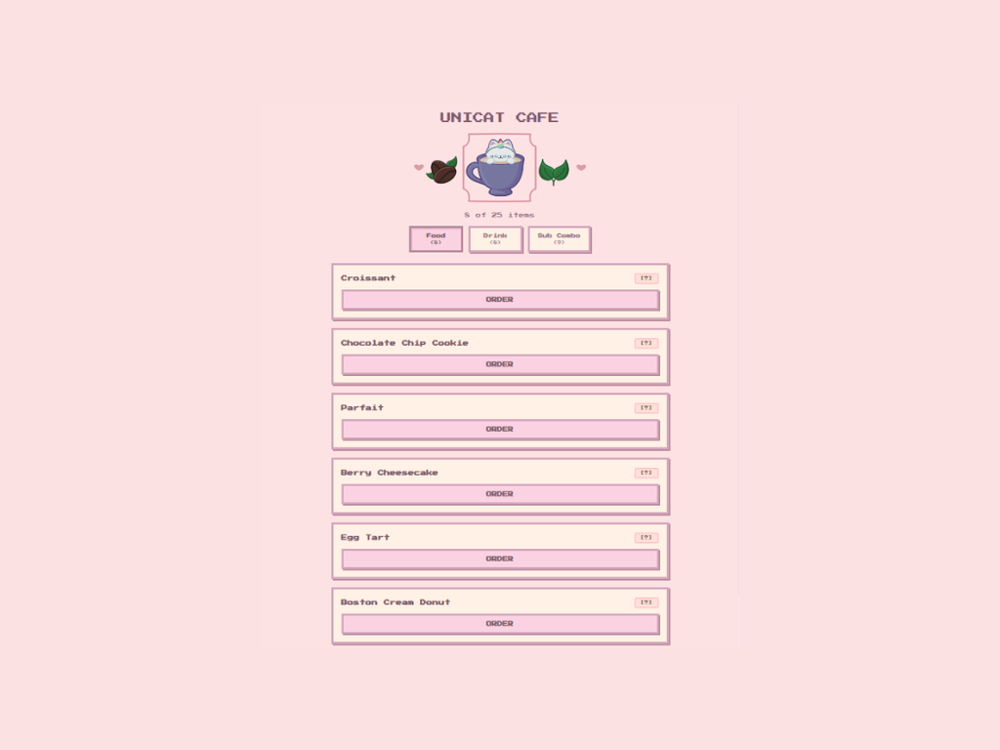
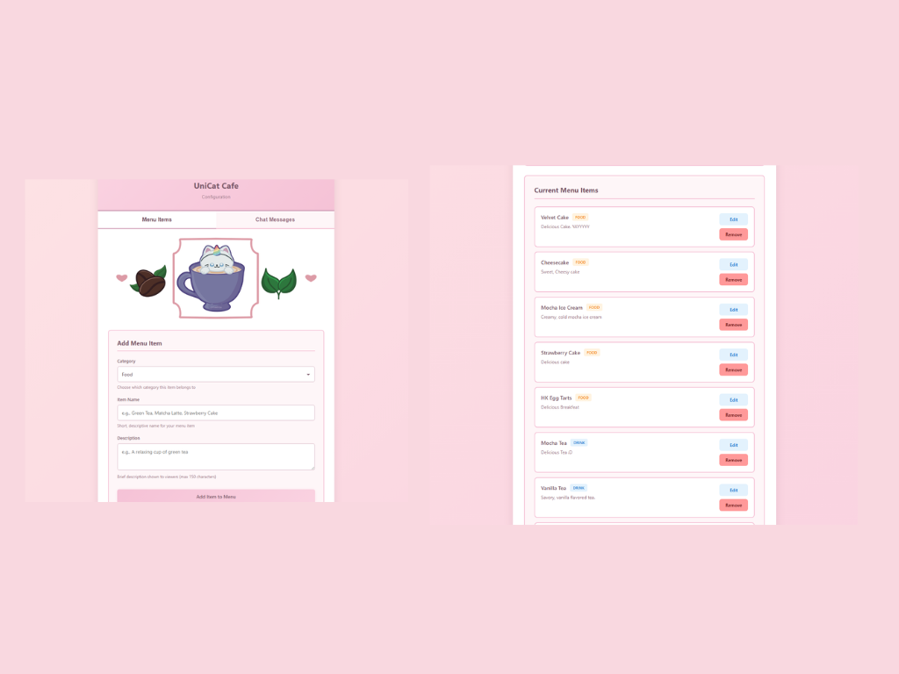
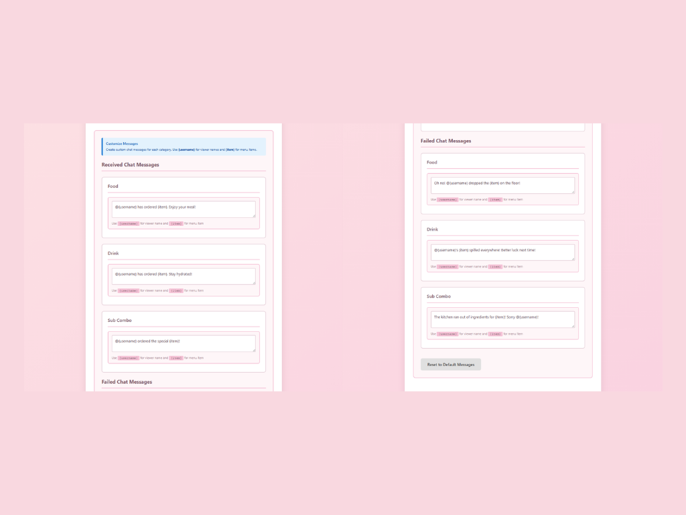

# UniCat Cafe

**A free, open-source Twitch Extension that brings a cozy virtual cafe experience to your stream.**

UniCat Cafe lets your viewers browse a menu, place orders, and receive personalized responses through your chat bot — turning passive viewers into active cafe regulars. Inspired by cozy cafe games like *Kimino Tea Time*, it's designed to feel warm, nostalgic, and genuinely fun to interact with.

---

## ✨ Features

- **Interactive menu panel** — Viewers can browse categorized items (Food, Drink, Sub Combos) and place orders directly from the extension panel
- **CafeCatBot integration** — Orders trigger personalized chat messages, making every interaction visible to the whole stream
- **Retro pixel art aesthetic** — Custom pixel art assets with a pastel color palette and Press Start 2P font for that cozy cafe vibe
- **Cooldown system** — Client-side cooldowns prevent spam without any extra backend overhead
- **Collapsible item descriptions** — Clean, browsable menu that doesn't overwhelm the panel
- **Surprise failure messages** — Orders occasionally go a little sideways, with humorous follow-up messages to keep things fun
- **Stateless & serverless** — No database required; built on Vercel serverless functions and Twitch's Configuration Service
- **Free, forever** — No paywalls, no subscriptions

---

## 📸 Screenshots

### Viewer Panel

### Configuration

---

## 🛠️ Tech Stack

- **Frontend** — Vanilla JavaScript, CSS with pixel art styling, localStorage for cooldown state
- **Backend** — Node.js serverless functions hosted on Vercel
- **Auth** — Twitch JWT verification for secure Extension API calls
- **Storage** — Twitch Configuration Service (no external database needed)
- **Chat** — Twitch IRC / bot OAuth for CafeCatBot messages
- **Assets** — Custom pixel art by [munchtea](https://munchtea.carrd.co) *(licensed — see below)*

---

## 🚀 Getting Started

### For Streamers

1. Find **UniCat Cafe** in the Twitch Extension Directory and add it to your channel like any other panel extension
2. Follow the in-panel configuration to connect CafeCatBot to your chat and set up your menu
3. That's it — your viewers can start ordering! 🎉

No programming experience needed. If you're comfortable with basic Twitch management like adding extensions and modding a bot, you're good to go.

### For Viewers

Once a streamer has UniCat Cafe installed, you'll see the cafe panel below their stream. Browse the menu, pick something you like, and place your order — CafeCatBot will announce it in chat for everyone to see.

---

## 🎨 Asset Credits & Licensing

Pixel art assets were created by **munchtea** and are used with permission under a custom license agreement. These assets are:

- ✅ Free to use as part of this extension
- ❌ Not to be used for commercial redistribution
- ❌ Not to be used for AI training datasets
- ❌ Not to be extracted and reused outside of this project without permission

Please respect the artist's work. If you'd like to commission munchtea for your own project, reach out separately.

---

## 🤝 Contributing

Contributions are welcome! Whether it's bug reports, feature suggestions, or pull requests, feel free to open an issue or start a discussion. This project is a portfolio piece built with love for the streaming community, and community input helps make it better.

Please be mindful of the asset licensing when contributing — do not add, replace, or modify the pixel UI art assets without explicit permission.

---

## 📄 License

This project is open-source under the [MIT License](./LICENSE), with the exception of art assets which belongs to munchtea (see above).

---

## 💌 About

UniCat Cafe was created by **Norumai** as a passion project to bring a little more warmth and interactivity to cozy streams. It's free, it'll always be free, and the source is open because the streaming community deserves tools built with transparency and good intentions.

If you use UniCat Cafe on your stream, feel free to share — it'd genuinely make my day. ☕🐾

