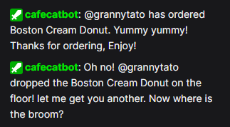

# 🐱 Getting Started with UniCat Cafe

Welcome to **UniCat Cafe** — a free, open-source Twitch Extension that brings a cozy virtual cafe experience to your stream! Viewers can browse a customizable menu and place orders, and **CafeCatBot** will announce them in chat with fun, personalized messages.

---

## Table of Contents

- [For Streamers](#for-streamers)
  - [Step 1: Install the Extension](#step-1-install-the-extension)
  - [Step 2: Mod CafeCatBot](#step-2-mod-cafecatbot)
  - [Step 3: Configure Your Menu](#step-3-configure-your-menu)
  - [Step 4: Customize Your Messages](#step-4-customize-your-messages)
  - [Step 5: Go Live!](#step-5-go-live)
- [For Viewers](#for-viewers)
  - [How to Use the Menu](#how-to-use-the-menu)
  - [Linking Your Identity](#linking-your-identity)
  - [Cooldowns](#cooldowns)
- [FAQ](#faq)
- [Need Help?](#need-help)

---

## For Streamers

### Step 1: Install the Extension

1. Go to your **Twitch Creator Dashboard** → **Extensions**.
2. Search for **UniCat Cafe** and click **Install**.
3. Activate it as a **Panel** on your channel page.

> 💡 The extension panel appears below your stream. Viewers can browse your menu from there at any time, even when you're offline.


---

### Step 2: Mod CafeCatBot

CafeCatBot is the shared bot account that posts order messages in your chat. It is **recommended, but not required**, to mod the account in order to send the personalized message.

In your Twitch chat, type:

```
/mod CafeCatBot
```

---

### Step 3: Configure Your Menu

After adding the extension, the **Extension Configuration** panel will automatically open and prompt the streamer to add an item.
If that is not the case, open the **Extension Configuration** panel in your Twitch Creator Dashboard. This is where you build your cafe menu.

**To add a menu item:**

1. Select a **Category** — choose from `Food`, `Drink`, or `Sub Combo`. This will appear in a dropdown menu when you click the fieldbox.
2. Enter an **Item Name** (e.g., `Matcha Latte`, `Strawberry Cake`).
3. Add a short **Description** (e.g., `A smooth, earthy green tea latte`).
4. Click **Add Item**.

**Tips:**

- You can add as many items as you like across all three categories.
- Duplicate item names are not allowed within the same save — keep names unique!
- Make sure to click **Save All Changes** button when you're done to push any changes to the menu live to viewers.
- If you're adding items to an already configured menu, viewers/streamers may need to **refresh their Twitch page** for the new items to appear in the panel.

---

### Step 4: Customize Your Messages

Each category has two message templates — one **success message** and one **fail message**. Every order will always trigger the success message, but there is an **8% chance** a follow-up fail message also fires right after (think: spilling a drink, dropping food, etc.). It's a bit of fun chaos for chat!

**Required placeholders** (these will be replaced with actual username and item when a viewer place an order):

| Placeholder | What It Becomes |
|---|---|
| `{username}` | The viewer's Twitch display name |
| `{item}` | The name of the ordered menu item |

**Example success message:**
```
@{username} just ordered a {item} — coming right up! ☕
```

**Example fail message (8% chance, fires after the success message):**
```
Oh no! @{username} dropped their {item} on the floor! Better luck next time!
```

> ⚠️ Both `{username}` and `{item}` are **required** in every message template. The configuration won't save without them.

You can click **Reset Messages** at any time to restore the default templates.



---

### Step 5: Go Live!

Once your menu is saved, you're all set. The panel will immediately reflect your menu for viewers. Go enjoy your stream — your cafe is open! 🎉

---

## For Viewers

### How to Use the Menu

1. Find the **UniCat Cafe** panel below the stream.
2. Browse the menu tabs: **Food**, **Drink**, and **Sub Combo**.
3. Find something you like and click the **Order** button.
4. CafeCatBot will post a message in chat announcing your order!

> 📱 The panel is only optimized for desktop viewing. If you're on the mobile app, you will not see the panel — check the channel page directly for access.

---

### Linking Your Identity

For CafeCatBot to mention you by name in chat, you need to **link your Twitch identity** to the extension. Don't worry — this is a standard Twitch permission, and you can revoke it at any time through your Twitch account settings.

If your identity isn't linked yet, the panel will prompt you with a button to grant permission. You only need to do this once.

> 🔒 **Privacy Note:** UniCat Cafe does not store your personal data on any servers. Your username is only used in the moment to craft the chat message and is never saved or shared. See the [Privacy Policy](./PRIVACY.md) for full details.

If you prefer not to link your identity, the extension won't be able to place orders on your behalf — linking is required for the ordering feature to work.

---

### Cooldowns

To keep chat from getting spammed, there's a **1-minute cooldown** between orders. After placing an order, you'll see a timer in the panel (below the menu) showing when you can order again. Just hang tight and enjoy the stream in the meantime! ☕

---

## FAQ

**Q: Is UniCat Cafe free?**  
Yes, completely free — no subscriptions, no premium tiers, no bits. It's also fully open-source.

**Q: Does CafeCatBot need to be modded even if I'm the streamer?**  
Yes. Without mod status, Twitch may rate-limit or restrict the bot from posting in chat, especially if chat is in follower-only or subscriber-only mode. Modding ensures reliable message delivery.

**Q: Can I customize the cooldown duration?**  
The default cooldown is 1 minute. Cooldown customization options may be added in a future update based on community feedback.

**Q: What are "Sub Combos"?**  
Sub Combos are a special menu category you can use to create exclusive or themed items — great for subscriber-only specials or limited-time offers you want to highlight separately from your regular food and drink menu.

**Q: The bot isn't posting in my chat. What do I do?**  
Check the following:

- Confirm CafeCatBot is modded in your channel (`/mod CafeCatBot`).
- Make sure your menu has been configured and saved in the extension config page.
- Verify your chat isn't in a mode that blocks non-subscriber bots.
- If issues persist, reach out at **twitch.norumai@gmail.com**.

**Q: Can I suggest new features or report bugs?**  
Absolutely! Open an issue on the [GitHub repository](https://github.com/Norumai01/UniCat-Cafe) or send feedback to **twitch.norumai@gmail.com**.

---

## Need Help?

- 📧 Email: **twitch.norumai@gmail.com**
- 🐛 Bug reports & feature requests: [GitHub Issues](https://github.com/Norumai01/UniCat-Cafe/issues)
- 📄 Privacy Policy: [PRIVACY.md](./PRIVACY.md)
- 📋 Terms of Service: [TERMS.md](./TERMS.md)

---

_Art assets in UniCat Cafe were created by [munchtea](https://munchtea.carrd.co/) and are used with permission. Please review the [Terms of Service](./TERMS.md) for artwork usage restrictions._
